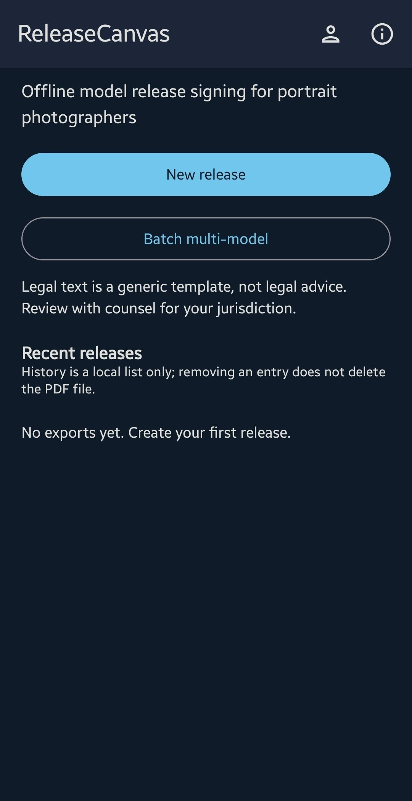
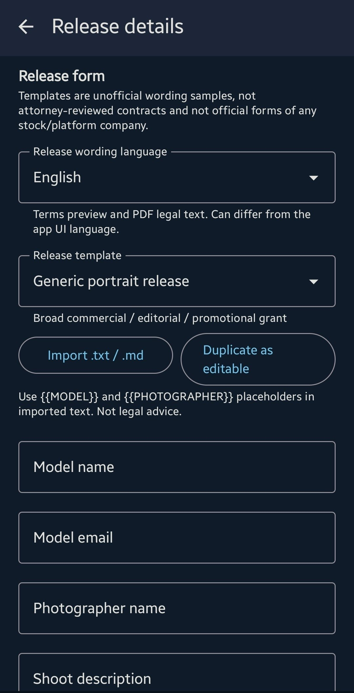
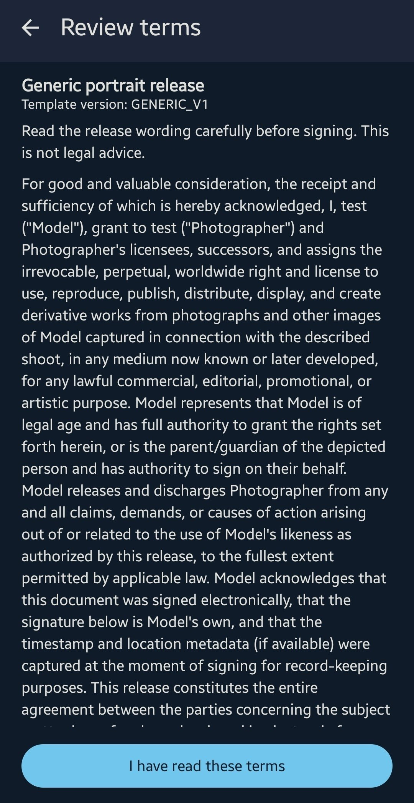
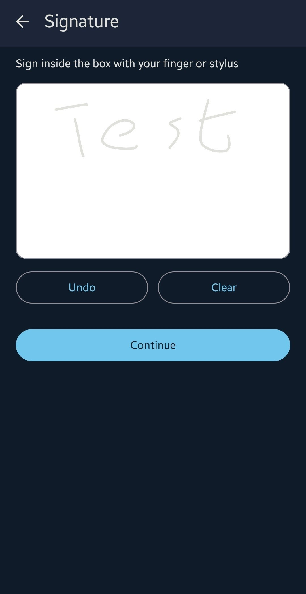
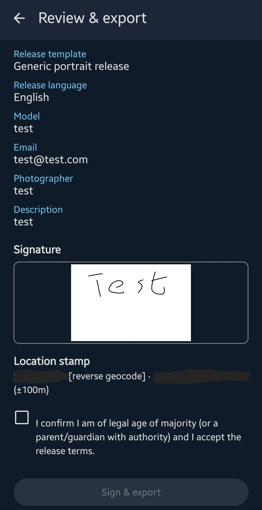
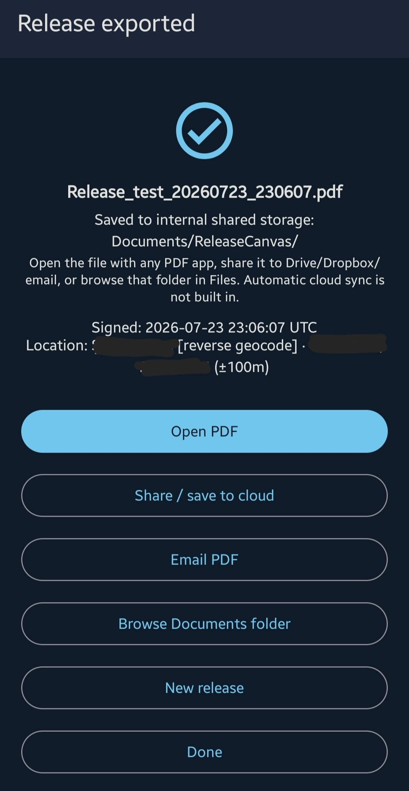
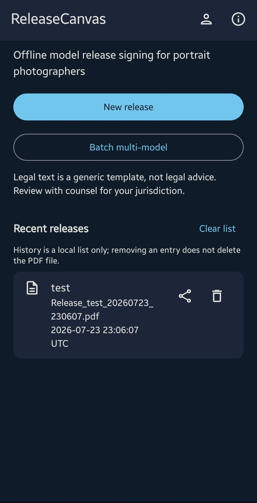

# ReleaseCanvas

[](LICENSE)
[](https://android-arsenal.com/api?level=29)
[](https://kotlinlang.org/)

**Offline digital model-release signing** for portrait photographers.

Capture shoot details and a finger/stylus signature, then export a PDF stamped with **UTC time** and **GPS** (when available) into `Documents/ReleaseCanvas/` via MediaStore.

> **Legal disclaimer:** the included release wording is a **generic template**, not legal advice. Have counsel review language for your jurisdiction before commercial use.

> **AI-assisted development:** most of this codebase was produced with AI coding assistance. **All changes were reviewed, tested, and approved by humans** before merge. AI does not replace maintainer responsibility for quality or fitness for purpose.

### Platforms

| Surface | Status |
|---------|--------|
| **Android app** | Full product (API 29+) — preferred when available |
| **Web companion** | **Sign & export only** (static site, GitHub Pages) — fills the gap for iPhone/desktop browsers |
| **Native iOS app** | **Not available yet** — we do not have an Apple device for proper testing |

Web scope intentionally **excludes** history, profile/branding, batch, and full localization. Prefer Android for the complete workflow.

- Source: [`web/`](web/) · local: `cd web && python3 -m http.server 8080`
- Live site (after Pages is enabled): `https://arianar.github.io/ReleaseCanvas/`

---

## Features

- Form fields: model name, email, photographer name, shoot description
- Optional shoot metadata (shoot ID, contacts, client, notes)
- **Release template picker** (generic, 500px-style unofficial, stock RF-style, editorial, social/web)
- **Two language pickers**: app UI language × release wording language (en, es, fr, it, de, fa; Persian RTL)
- **Batch multi-model**: shared shoot details, then sign/export one PDF per model in sequence
- **Share / save to cloud** via the system share sheet (Drive, Dropbox, email, …) — no automatic sync
- Optional **city / country** (manual) or best-effort reverse geocode from GPS when online
- Interactive signature pad (clear / undo)
- Best-effort GPS via Fused Location Provider (export works without location)
- PDF via Android `PdfDocument` (terms + signature image + metadata)
- Local history of recent exports
- Photographer name remembered between sessions (DataStore)
- Fully offline after install (location optional; geocode needs network when used)


## FAQ

### Why aren’t official 500px / Getty / stock-agency release forms in the app?

ReleaseCanvas does **not** redistribute third-party platform forms. Official model-release text is typically **copyrighted**, may be **trademark-branded**, and is governed by each platform’s **terms of service**. Shipping those documents as if they were “the official form” would imply endorsement and create legal risk for users and maintainers.

What we provide instead:

- **Inspired, unofficial sample templates** (e.g. “500px-style (unofficial)”, stock RF-style) clearly labeled as samples, **not** legal advice
- **Custom template import and editing** so you can use wording you have the right to use (counsel-reviewed text, your studio’s form, etc.)
- Export as your own PDF with signature and metadata

If a platform ever grants an explicit redistribution license, we could revisit embedding their form. Until then, treat built-ins as starting points and import official text only when **you** are licensed to use it.

### Is there an iPhone app?

Not yet. **Native iOS is blocked on testing access** (no Apple hardware in the maintainer setup). Photographers on iOS can use the **[web companion](web/)** (GitHub Pages) for form → sign → download/share PDF. The full feature set remains on **Android**.

### How do I back up PDFs to Google Drive / Dropbox / the cloud?

ReleaseCanvas is **offline-first**: every release is written under **Documents/ReleaseCanvas** on the device. There is **no automatic cloud sync** and no multi-vendor storage SDK.

To keep a copy off-device:

1. After export, tap **Share / save to cloud** (or use the share icon on a history row).
2. Pick **Drive**, **Dropbox**, **Files**, email, etc. from the system share sheet.
3. The file leaves the device only under **your** account and the app you choose.

## Screenshots

Device captures (Android). EXIF stripped; location redacted in review/success.

| Home | Form | Terms | Signature |
|------|------|-------|-----------|
|  |  |  |  |

| Review | Success | History |
|--------|---------|---------|
|  |  |  |

## Requirements

| Tool | Notes |
|------|--------|
| [Android Studio](https://developer.android.com/studio) | Quail 2 / recent stable |
| JDK | 17+ (Studio **jbr-21** recommended) |
| Android SDK | Platform **36**, build-tools |
| Device / emulator | **API 29+** |

## Quick start (Android Studio)

1. **File → Open** → this repository root  
2. Trust the Gradle project and wait for sync (wrapper **8.11.1**, AGP **8.7.3**)  
3. Gradle JDK: **Settings → Build Tools → Gradle → Gradle JDK → jbr-21**  
4. Run configuration **app** → device/emulator → **Run**

Studio will create `local.properties` with your SDK path (gitignored).

## CLI build

```bash
export JAVA_HOME=$(dirname $(dirname $(readlink -f $(which java))))
export ANDROID_HOME=$HOME/Android/Sdk   # or your Studio SDK path
./gradlew :app:assembleDebug
./gradlew :app:testDebugUnitTest
```

Debug APK: `app/build/outputs/apk/debug/app-debug.apk`

### Release APK (signed, free self-signed keystore)

Signing does **not** require Google Play or any fee. Use a local keystore that is **never committed**.

1. Keystore file at repo root: `release-canvas.jks` (already gitignored via `*.jks`)
2. Copy `keystore.properties.example` → `keystore.properties` and set passwords/alias  
3. Build:

```bash
./gradlew :app:assembleRelease
```

Output: `app/build/outputs/apk/release/app-release.apk`

If `keystore.properties` is missing, the release build is unsigned/debug-signed depending on the toolchain — always keep `keystore.properties` local for real installs.

#### GitHub Actions (signed APK on tags)

Workflow: [`.github/workflows/release-apk.yml`](.github/workflows/release-apk.yml)

| Trigger | Result |
|---------|--------|
| Push tag `v*` (e.g. `v1.6.1`) | Build signed APK → attach `ReleaseCanvas-vX.Y.Z.apk` to that GitHub Release |
| **Actions → Release signed APK → Run workflow** | Build only; APK as workflow artifact (no Release attach) |

Repository secrets (Settings → Secrets and variables → Actions):

- `RELEASE_KEYSTORE_BASE64` — `base64 -w0 release-canvas.jks`
- `RELEASE_STORE_PASSWORD`
- `RELEASE_KEY_ALIAS`
- `RELEASE_KEY_PASSWORD` (usually same as store password)

Never commit the keystore or `keystore.properties`.

## Usage flow

1. **New release** → fill form  
2. **Sign** on the canvas  
3. **Review** → grant location if desired → **Sign & export**  
4. Open, share, or start another release  

Metadata (UTC instant + location) is captured **when export starts**, not when the pad opens.

## Permissions

| Permission | Why |
|------------|-----|
| Fine / coarse location | Optional GPS stamp at sign time |

No legacy storage permission on API 29+. PDFs are created through MediaStore under **Documents/ReleaseCanvas**.

## Project structure

```
app/src/main/java/com/releasecanvas/app/
├── ui/           # Compose screens, theme, navigation, signature pad
├── data/         # Location, PDF, MediaStore, DataStore
└── util/         # Formatters, validation
```

## Stack

- Kotlin · Jetpack Compose · Material 3  
- Navigation Compose · ViewModel · Coroutines · DataStore  
- Play Services Location  
- `PdfDocument` + MediaStore  

## Contributing

See [CONTRIBUTING.md](CONTRIBUTING.md). Please read the [Code of Conduct](CODE_OF_CONDUCT.md).

- Bug reports & features: [Issues](https://github.com/ArianAr/ReleaseCanvas/issues)  
- Security: [SECURITY.md](SECURITY.md) (private reporting preferred)

## Roadmap

See **[ROADMAP.md](ROADMAP.md)** for shipped versions, current focus, and non-goals.

Active tracking: [milestones](https://github.com/ArianAr/ReleaseCanvas/milestones) · [issues](https://github.com/ArianAr/ReleaseCanvas/issues)

## License

[GNU General Public License v3.0](LICENSE)

```
Copyright (C) ReleaseCanvas contributors
```
