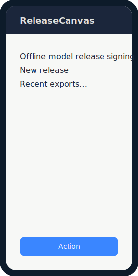
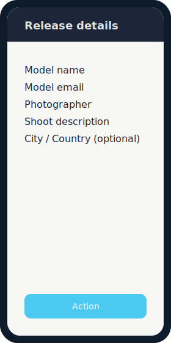
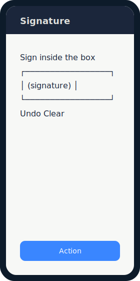
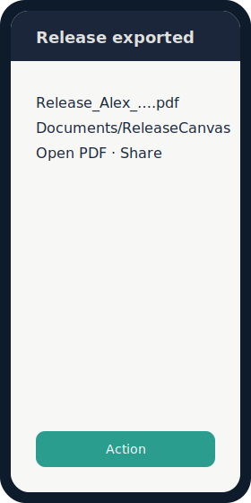

# ReleaseCanvas

[](LICENSE)
[](https://android-arsenal.com/api?level=29)
[](https://kotlinlang.org/)

**Offline digital model-release signing** for portrait photographers.

Capture shoot details and a finger/stylus signature, then export a PDF stamped with **UTC time** and **GPS** (when available) into `Documents/ReleaseCanvas/` via MediaStore.

> **Legal disclaimer:** the included release wording is a **generic template**, not legal advice. Have counsel review language for your jurisdiction before commercial use.

---

## Features

- Form fields: model name, email, photographer name, shoot description
- Optional shoot metadata (shoot ID, contacts, client, notes)
- **Release template picker** (generic, 500px-style unofficial, stock RF-style, editorial, social/web)
- **Two language pickers**: app UI language × release wording language (en, es, fr, it, de, fa; Persian RTL)
- Optional **city / country** (manual) or best-effort reverse geocode from GPS when online
- Interactive signature pad (clear / undo)
- Best-effort GPS via Fused Location Provider (export works without location)
- PDF via Android `PdfDocument` (terms + signature image + metadata)
- Local history of recent exports
- Photographer name remembered between sessions (DataStore)
- Fully offline after install (location optional; geocode needs network when used)


## FAQ

### Why aren’t official 500px / Getty / stock-agency release forms in the app?

ReleaseCanvas does **not** redistribute third-party platform forms. Official model-release text is typically **copyrighted**, may be **trademark-branded**, and is governed by each platform’s **terms of service**. Shipping those documents as if they were “the official form” would imply endorsement and create legal risk for users and maintainers.

What we provide instead:

- **Inspired, unofficial sample templates** (e.g. “500px-style (unofficial)”, stock RF-style) clearly labeled as samples, **not** legal advice
- **Custom template import and editing** so you can use wording you have the right to use (counsel-reviewed text, your studio’s form, etc.)
- Export as your own PDF with signature and metadata

If a platform ever grants an explicit redistribution license, we could revisit embedding their form. Until then, treat built-ins as starting points and import official text only when **you** are licensed to use it.

## Screenshots

Mock UI frames (replace with device captures anytime):

| Home | Form | Signature | Success |
|------|------|-----------|---------|
|  |  |  |  |

## Requirements

| Tool | Notes |
|------|--------|
| [Android Studio](https://developer.android.com/studio) | Quail 2 / recent stable |
| JDK | 17+ (Studio **jbr-21** recommended) |
| Android SDK | Platform **36**, build-tools |
| Device / emulator | **API 29+** |

## Quick start (Android Studio)

1. **File → Open** → this repository root  
2. Trust the Gradle project and wait for sync (wrapper **8.11.1**, AGP **8.7.3**)  
3. Gradle JDK: **Settings → Build Tools → Gradle → Gradle JDK → jbr-21**  
4. Run configuration **app** → device/emulator → **Run**

Studio will create `local.properties` with your SDK path (gitignored).

## CLI build

```bash
export JAVA_HOME=$(dirname $(dirname $(readlink -f $(which java))))
export ANDROID_HOME=$HOME/Android/Sdk   # or your Studio SDK path
./gradlew :app:assembleDebug
./gradlew :app:testDebugUnitTest
```

Debug APK: `app/build/outputs/apk/debug/app-debug.apk`

## Usage flow

1. **New release** → fill form  
2. **Sign** on the canvas  
3. **Review** → grant location if desired → **Sign & export**  
4. Open, share, or start another release  

Metadata (UTC instant + location) is captured **when export starts**, not when the pad opens.

## Permissions

| Permission | Why |
|------------|-----|
| Fine / coarse location | Optional GPS stamp at sign time |

No legacy storage permission on API 29+. PDFs are created through MediaStore under **Documents/ReleaseCanvas**.

## Project structure

```
app/src/main/java/com/releasecanvas/app/
├── ui/           # Compose screens, theme, navigation, signature pad
├── data/         # Location, PDF, MediaStore, DataStore
└── util/         # Formatters, validation
```

## Stack

- Kotlin · Jetpack Compose · Material 3  
- Navigation Compose · ViewModel · Coroutines · DataStore  
- Play Services Location  
- `PdfDocument` + MediaStore  

## Contributing

See [CONTRIBUTING.md](CONTRIBUTING.md). Please read the [Code of Conduct](CODE_OF_CONDUCT.md).

- Bug reports & features: [Issues](https://github.com/ArianAr/ReleaseCanvas/issues)  
- Security: [SECURITY.md](SECURITY.md) (private reporting preferred)

## Roadmap

See **[ROADMAP.md](ROADMAP.md)** for shipped versions, current focus, and non-goals.

Active tracking: [milestones](https://github.com/ArianAr/ReleaseCanvas/milestones) · [issues](https://github.com/ArianAr/ReleaseCanvas/issues)

## License

[GNU General Public License v3.0](LICENSE)

```
Copyright (C) ReleaseCanvas contributors
```
